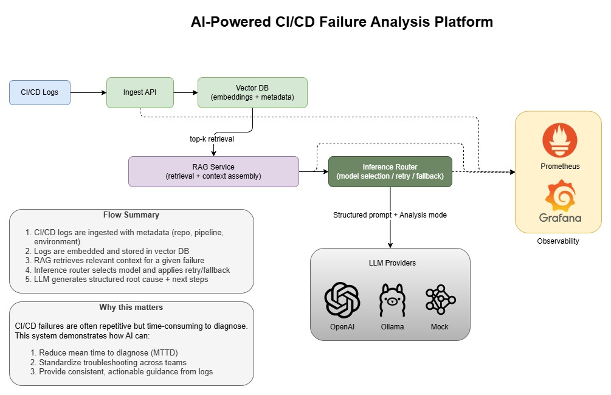
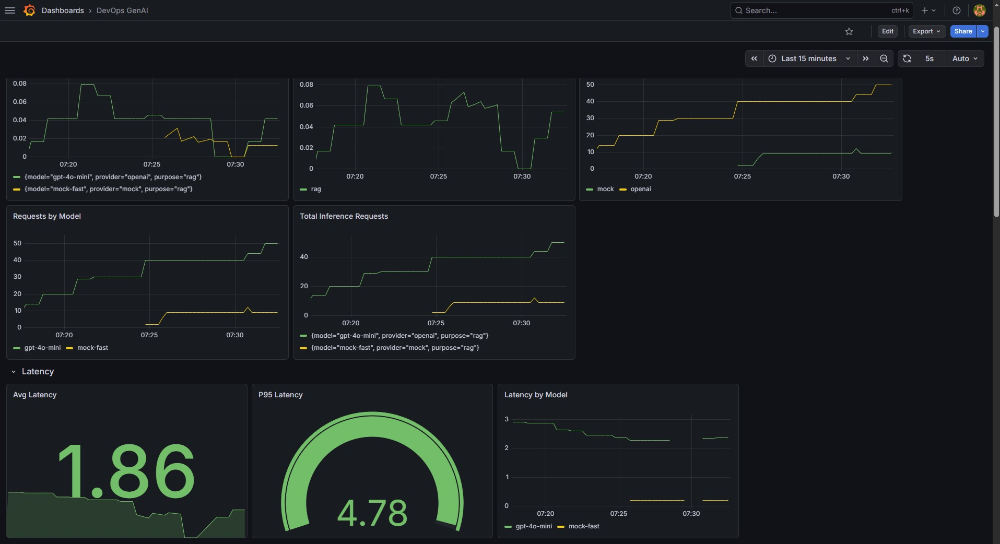
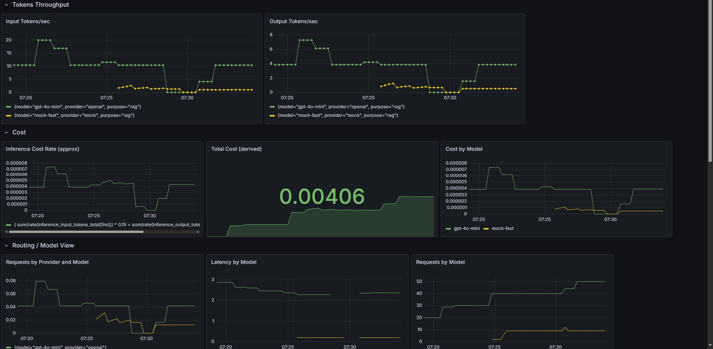
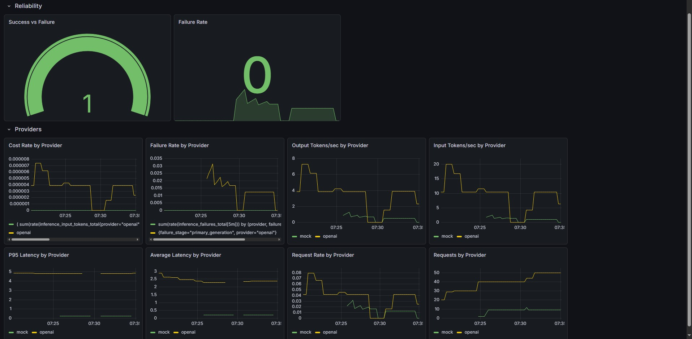
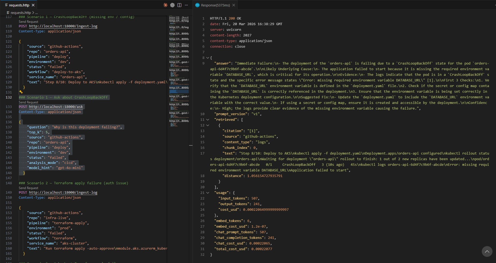
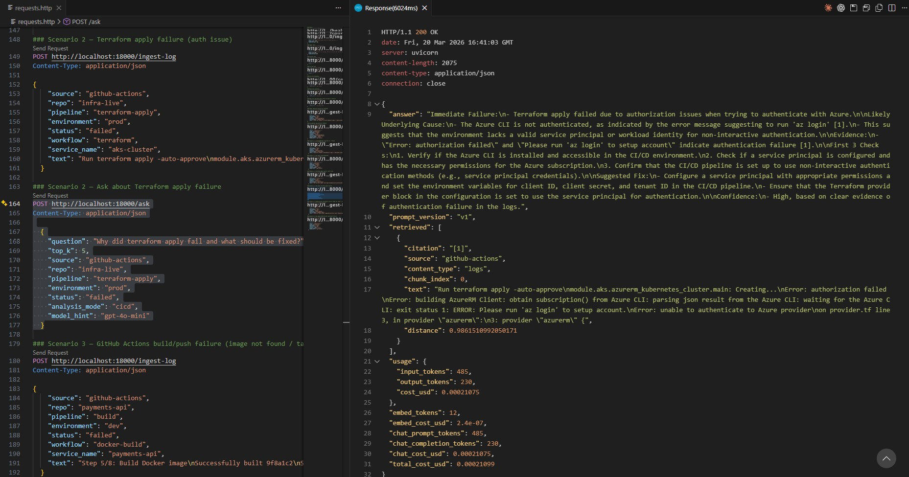
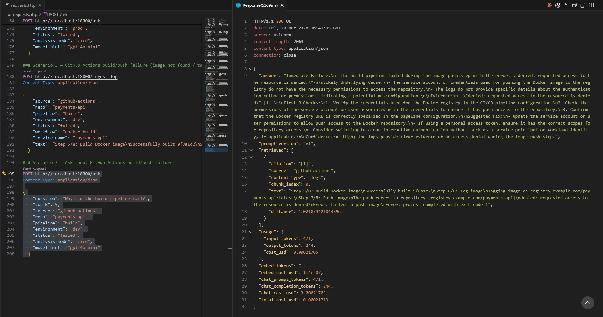

# DevOps GenAI Platform

[](https://github.com/GauJosh/devops-genai/actions/workflows/ci.yml)


**DevOps GenAI Platform** is an AI infrastructure engineering lab for platform teams that want more than a chatbot.

It combines:
- metadata-aware RAG retrieval
- multi-provider inference routing
- Kubernetes-native deployment patterns
- CI/CD failure diagnosis
- structured fix suggestion generation
- guarded PR automation through a Python executor
- token, latency, and cost observability

This repo is designed to demonstrate how an AI system can behave like a **platform capability**: ingesting operational evidence, reasoning over the right context, and assisting with safe remediation workflows.

---

## Why this product stands out

Most GenAI demos answer questions.

This platform does that **and**:
- ingests incident logs and knowledge-base docs
- retrieves only context relevant to a specific repo/workflow/run
- generates CI/CD-focused diagnosis with evidence
- proposes machine-readable fixes with verification steps, patch text, and workflow actions
- routes inference across OpenAI, Ollama, and Mock providers
- measures cost, traffic, failures, and latency
- can open a PR from a suggested fix while preserving human review and no-merge safety

It is a practical blueprint for **AI-assisted DevOps and platform operations**.

---

## Architecture at a glance

```text
Logs / Runbooks / KB Docs
                    ↓
            Ingest API
                    ↓
 Vector Store + Metadata
                    ↓
         RAG Service
                    ↓
    Inference Router
                    ↓
OpenAI / Ollama / Mock
                    ↓
Diagnosis / Fix Suggestions / PR Workflow
                    ↓
Prometheus / Grafana / Cost Tracking
```

### Core building blocks

- **`rag-service`**
    - ingest docs and logs
    - retrieve by metadata filters
    - answer questions with citations
    - generate structured fix suggestions
    - expose usage and cost data

- **`inference-router`**
    - route by `model_hint`
    - retry transient failures
    - fall back to alternate providers
    - emit operational metrics

- **Python executor**
    - discover failed GitHub runs
    - fetch and clean failed logs
    - ingest incident data
    - inspect target repo state
    - call `/suggest-fix`
    - validate and re-evaluate with runtime evidence
    - create a reviewable PR when gates pass

- **Kubernetes + dashboards**
    - deployable services with persistent vector storage
    - health checks, autoscaling, config separation
    - dashboards for platform visibility

## Architecture diagram



---

## Functional capabilities

### 1) Metadata-aware retrieval for operational incidents
- document and log ingestion with different chunking strategies
- retrieval filters on `repo`, `pipeline`, `environment`, `status`, `workflow`, `service_name`, `run_id`
- source browsing and inspection APIs
- hybrid context support for incident logs plus KB docs

### 2) CI/CD failure analysis
- specialized CI/CD prompt mode in `/ask`
- clear separation of symptom, root cause, and next checks
- concise operator-friendly output
- support for common delivery and runtime failure patterns

### 3) Structured fix suggestion engine
`/suggest-fix` produces typed remediation objects containing:
- `diagnosis`
- `fix_type`
- `target_file`
- `target_changes`
- `why_this_fix`
- `evidence_used`
- `assumptions`
- `verification_steps`
- `alternatives_considered`
- `patch_text`
- `workflow`
- `safe_to_auto_apply`
- `confidence`
- `requires_review`

### 4) Safety-first automation model
- evidence-first prompting
- anti-hallucination and anti-assumption rules
- PR-only policy
- no automatic merge
- checkout and repo-inspection requirements for high-confidence automation
- server-side confidence gating based on runtime evidence

### 5) Multi-provider inference architecture
- OpenAI for cloud inference
- Ollama for local/alternate model serving
- Mock provider for fallback/testing
- retry/backoff and fallback logic in the router

### 6) End-to-end remediation executor
- GitHub failed-run discovery
- failed-log download and cleanup
- auto-ingestion into RAG
- repo auto-clone or repo reuse
- validation command derivation from suggested fix steps
- patch normalization and remediation fallback
- transient artifact cleanup before commit
- guarded PR creation

### 7) Full observability surface
- structured JSON logs
- inference request/failure metrics
- token accounting
- request cost estimation
- Grafana dashboards for traffic, cost, latency, and failures

---

## What is implemented right now

### Retrieval and knowledge layer
- `POST /ingest`
- `POST /ingest-log`
- embeddings with `text-embedding-3-small`
- Chroma-backed vector retrieval
- metadata-aware filtering
- source and ingested-chunk inspection endpoints

### Diagnosis layer
- `POST /ask`
- general question-answer mode
- CI/CD-specific analysis mode

### Remediation layer
- `POST /suggest-fix`
- hybrid retrieval from logs + KB
- structured fix schema and parsing
- runtime context injection from executor
- post-generation safety and confidence enforcement

### Inference layer
- `POST /v1/generate`
- provider abstraction
- retries and timeouts
- fallback support
- request tracing support

### Automation layer
- pure Python executor in [tools/suggest_fix_executor.py](tools/suggest_fix_executor.py)
- failed GitHub run lookup
- log cleanup and ingestion loop
- repo checkout/reset/clean flow
- patch application with normalization
- PR creation with strict guardrails

### Evaluation and visibility
- Prometheus metrics
- Grafana dashboards
- golden evaluation harness for answer and fix flows

---

## Repository structure

```text
devops-genai/
├── README.md
├── ROADMAP.md
├── requests.http
├── dashboard/
├── deploy/k8s/
├── docs/
├── eval/
├── images/
├── services/
│   ├── inference-router/
│   └── rag-service/
└── tools/
        ├── analyze_github_failure.sh
        └── suggest_fix_executor.py
```

### Important folders
- `services/rag-service/` – ingestion, retrieval, prompting, `/ask`, `/suggest-fix`
- `services/inference-router/` – routing, retries, fallback, metrics
- `tools/` – shell and Python automation flows
- `deploy/k8s/` – Kubernetes manifests
- `dashboard/` – Grafana JSON and demo screenshots
- `eval/` – regression harness
- `docs/` – architecture notes and design rationale

---

## Core product flows

### A. Ingestion flow
1. Accept raw text via `/ingest` or `/ingest-log`.
2. Chunk according to content type.
3. Generate embeddings.
4. Store vectors and metadata.
5. Make context searchable by incident scope.

### B. Diagnosis flow (`/ask`)
1. Embed the question.
2. Retrieve top relevant chunks.
3. Assemble context with citations.
4. Send prompt through inference-router.
5. Return answer, retrieved chunks, usage, and cost.

### C. Fix suggestion flow (`/suggest-fix`)
1. Retrieve incident logs and optional KB chunks.
2. Build structured remediation prompt.
3. Generate typed fix suggestions.
4. Parse diagnosis and fix objects.
5. Apply runtime-aware confidence policy.

### D. Executor flow
1. Discover the latest failed GitHub run.
2. Download and clean failed logs.
3. Ingest logs into the platform.
4. Ensure clean repo checkout.
5. Call `/suggest-fix`.
6. Run safe validation commands from suggested steps.
7. Re-evaluate with runtime evidence.
8. Create a PR when policy gates allow it.

---

## API surface

### `rag-service` (default `http://localhost:8000`)
- `GET /healthz`
- `POST /chat`
- `POST /ingest`
- `POST /ingest-log`
- `POST /ask`
- `POST /suggest-fix`
- `GET /sources`
- `GET /ingested`
- `GET /costs`
- `DELETE /reset?confirm=true`
- `DELETE /delete_source?source=...`

### `inference-router` (default `http://localhost:8001`)
- `GET /healthz`
- `GET /metrics`
- `POST /v1/generate`

---

## Model support

| Provider | Status | Notes |
|---|---|---|
| OpenAI | ✅ Supported | Default cloud inference path |
| Ollama | ✅ Supported | Local or alternate inference path |
| Mock | ✅ Supported | Lightweight fallback/testing path |

### Routing rules
- `gpt*` → OpenAI
- `llama*`, `phi*`, `mistral*`, `qwen*`, `gemma*` → Ollama
- `mock*` → Mock
- otherwise → default provider

---

## Local development

### 1) Python environment

```bash
python -m venv .venv
source .venv/Scripts/activate
```

### 2) Environment variables

Create `.env` in repo root:

```env
OPENAI_API_KEY=your_key_here
OPENAI_MODEL=gpt-4o-mini
OPENAI_MODEL_DEFAULT=gpt-4o-mini
OPENAI_EMBED_MODEL=text-embedding-3-small
CHROMA_DIR=./chroma_db

OLLAMA_BASE_URL=http://localhost:11434
OLLAMA_DEFAULT_MODEL=llama3.2:1b

ROUTER_DEFAULT_PROVIDER=openai
ROUTER_ENABLE_FALLBACK=true
ROUTER_FALLBACK_PROVIDER=mock

INFERENCE_ROUTER_URL=http://localhost:8001
INFERENCE_TIMEOUT_S=30
```

### 3) Install dependencies

```bash
pip install -r services/inference-router/requirements.txt
pip install -r services/rag-service/requirements.txt
```

### 4) Run services

Terminal A:

```bash
cd services/inference-router
uvicorn app.main:app --host 0.0.0.0 --port 8001 --reload
```

Terminal B:

```bash
cd services/rag-service
uvicorn app.main:app --host 0.0.0.0 --port 8000 --reload
```

Use [requests.http](requests.http) for quick endpoint testing.

---

## Quickstart scenarios

### Ingest CI/CD logs

```bash
curl -X POST http://localhost:8000/ingest-log \
    -H "Content-Type: application/json" \
    -d '{
        "source": "github-actions",
        "text": "<paste your failed pipeline logs here>",
        "repo": "payments-api",
        "pipeline": "deploy",
        "environment": "dev",
        "status": "failed",
        "workflow": "deploy.yml",
        "service_name": "payments-api"
    }'
```

### Diagnose with `/ask`

```bash
curl -X POST http://localhost:8000/ask \
    -H "Content-Type: application/json" \
    -d '{
        "question": "Why did this deployment fail and what should I check first?",
        "top_k": 5,
        "source": "github-actions",
        "repo": "payments-api",
        "pipeline": "deploy",
        "environment": "dev",
        "status": "failed",
        "analysis_mode": "cicd",
        "model_hint": "gpt-4o-mini"
    }'
```

### Generate structured fixes with `/suggest-fix`

```bash
curl -X POST http://localhost:8000/suggest-fix \
    -H "Content-Type: application/json" \
    -d '{
        "question": "Based on this failure, what are the actionable fixes?",
        "top_k": 5,
        "min_relevance": 2.0,
        "content_type": "logs",
        "source": "github-actions",
        "repo": "payments-api",
        "pipeline": "deploy",
        "environment": "dev",
        "status": "failed",
        "use_kb": true,
        "kb_source": "kb-playbook"
    }'
```

---

## Python executor

The executor connects diagnosis with safe action.

It can:
- discover the latest failed GitHub Actions run
- fetch and clean failed logs
- ingest logs into the RAG system
- auto-clone or reuse a target repo checkout
- inspect repo state and send runtime evidence to the agent
- render rich remediation suggestions
- normalize malformed diffs
- fall back to safe remediation commands when needed
- remove temporary artifacts before commit
- open PRs without any merge automation

### Example: local/manual mode

```bash
python tools/suggest_fix_executor.py \
    --agent-url http://localhost:8000 \
    --question "CI failed in deploy workflow with missing artifact" \
    --repo-path . \
    --source github-actions \
    --content-type logs \
    --use-kb
```

### Example: GitHub failed-run mode

```bash
python tools/suggest_fix_executor.py \
    --agent-url http://localhost:18000 \
    --github-repo GauJosh/cicd-demo \
    --github-workflow failing-ci \
    --ingest-logs \
    --use-kb
```

### Example: guarded PR creation

```bash
python tools/suggest_fix_executor.py \
    --agent-url http://localhost:18000 \
    --github-repo GauJosh/cicd-demo \
    --github-workflow failing-ci \
    --ingest-logs \
    --use-kb
```

PR creation is automatic when safe-to-apply gates pass. Use `--no-create-pr` to run analysis-only mode.

### PR rules
- PR only
- no auto-merge
- requires strong runtime evidence
- requires high-confidence suggestion output
- requires meaningful repo changes
- cleans transient files before commit

---

## Docker

Build images:

```bash
docker build -t rag-service:local services/rag-service
docker build -t inference-router:local services/inference-router
```

Run example:

```bash
docker run --rm -p 8001:8000 --env-file .env inference-router:local
docker run --rm -p 8000:8000 --env-file .env -e INFERENCE_ROUTER_URL=http://host.docker.internal:8001 rag-service:local
```

---

## Kubernetes deployment

Apply manifests:

```bash
kubectl apply -f deploy/k8s/namespace.yaml
kubectl apply -f deploy/k8s/configmap.yaml
kubectl apply -f deploy/k8s/secret.yaml
kubectl apply -f deploy/k8s/pvc.yaml
kubectl apply -f deploy/k8s/router-deployment.yaml
kubectl apply -f deploy/k8s/router-service.yaml
kubectl apply -f deploy/k8s/rag-deployment.yaml
kubectl apply -f deploy/k8s/rag-service.yaml
kubectl apply -f deploy/k8s/hpa.yaml
```

### Notes
- namespace: `devops-genai`
- persistent vector storage via PVC-backed Chroma
- HPA for both services
- set a valid `OPENAI_API_KEY` in [deploy/k8s/secret.yaml](deploy/k8s/secret.yaml)

---

## Observability

### Router metrics
- `inference_requests_total{provider,purpose,model}`
- `inference_failures_total{provider,purpose,failure_stage}`
- `inference_latency_seconds{provider,purpose,model}`
- `inference_input_tokens_total{provider,purpose,model}`
- `inference_output_tokens_total{provider,purpose,model}`

### Dashboard assets
- [dashboard/grafana-dashboard-v1.json](dashboard/grafana-dashboard-v1.json)
- [dashboard/grafana-dashboard-v2.json](dashboard/grafana-dashboard-v2.json)
- [dashboard/grafana-dashboard-v3.json](dashboard/grafana-dashboard-v3.json)

### Grafana links
- [Local Grafana home](http://localhost:3000)
- [Dashboards page](http://localhost:3000/dashboards)

### Dashboard gallery

| Dashboard View 1 | Dashboard View 2 | Dashboard View 3 |
|---|---|---|
|  |  |  |

---

## CI/CD analysis gallery

This project supports a log-to-remediation loop that combines:
- log-first retrieval
- metadata-scoped context selection
- evidence-backed diagnosis
- structured fixes
- guarded automation

| Scenario 1 | Scenario 2 | Scenario 3 |
|---|---|---|
|  |  |  |

---

## Evaluation harness

Run golden tests:

```bash
python eval/run_eval.py
```

Optional custom file:

```bash
python eval/run_eval.py eval/golden.json
```

---

## Useful docs

- [ROADMAP.md](ROADMAP.md)
- [docs/inference-architecture.md](docs/inference-architecture.md)
- [docs/multi-model-routing.md](docs/multi-model-routing.md)
- [docs/routing-policy.md](docs/routing-policy.md)

---

## Troubleshooting

- `OPENAI_API_KEY not set` → provide a key in `.env` or [deploy/k8s/secret.yaml](deploy/k8s/secret.yaml)
- `/ask` returns `Insufficient context` → ingest docs/logs first
- weak CI/CD answers → ensure incident metadata matches the failing run
- router 502s → inspect inference-router logs for retry/fallback failures
- no autoscaling → verify `metrics-server` exists in cluster
- noisy PRs → executor now removes transient artifacts before commit
- malformed patch text → executor normalizes diff hunks and can fall back to safe remediation commands

---

## Where this platform can go next

The current system already demonstrates a strong local and Kubernetes-native AI operations platform.

The next evolution is straightforward:
- expose the agent behind a secure DNS endpoint
- trigger executor from a separate workflow/repo
- move vector persistence to `pgvector`
- support cross-repo operational automation
- strengthen tenant isolation and enterprise access patterns

That turns this from a powerful demo into a compelling foundation for **AI-assisted platform operations at scale**.
